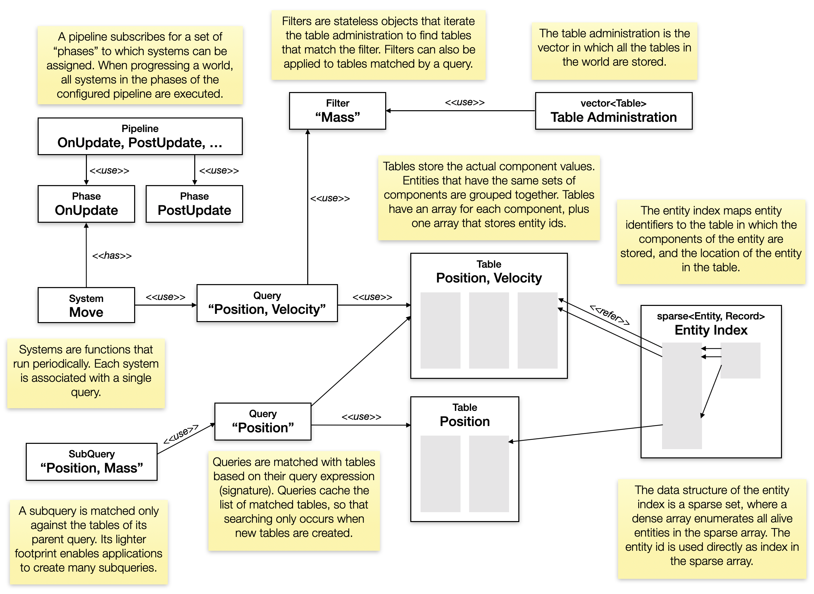
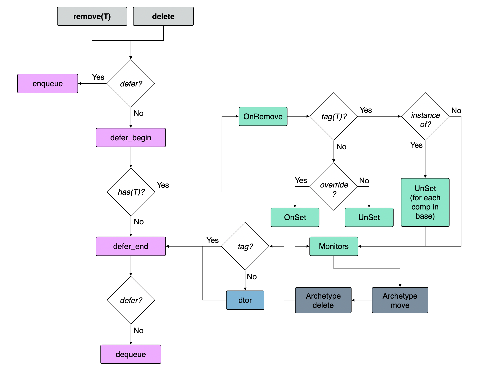
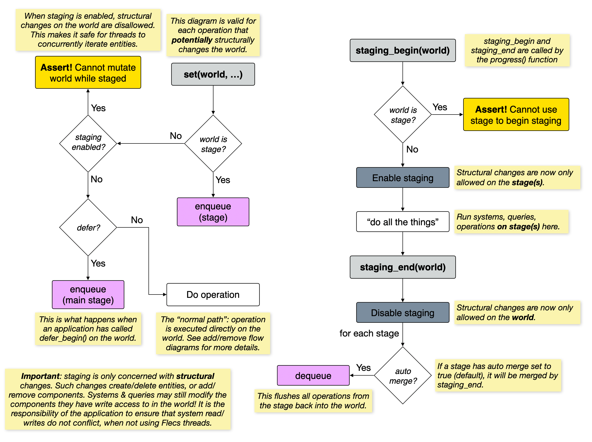

# roguelike

# [flecs](https://www.flecs.dev)
- [GitHub Repo](https://github.com/SanderMertens/flecs)
## Concepts
- [Phases and Pipelines](https://www.flecs.dev/flecs/md_docs_DesignWithFlecs.html#autotoc_md92)
  - Phases = update order
  - Pipelines = enfore ordering of scene entites
## Diagrams
#### High Level Architecture

#### Component add flow

#### Component remove flow

#### Staging flow

